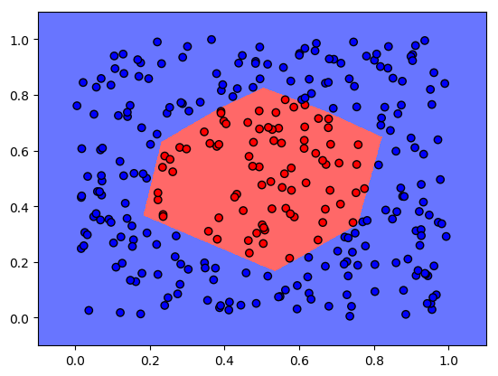

# Binary Classification

This is a TensorFlow implementation of two binary classification models. One using simple logistic regression, and another using a small feedforward neural network. For more information check out my blog article for this project http://cfml.se/blog/binary_classification/.
